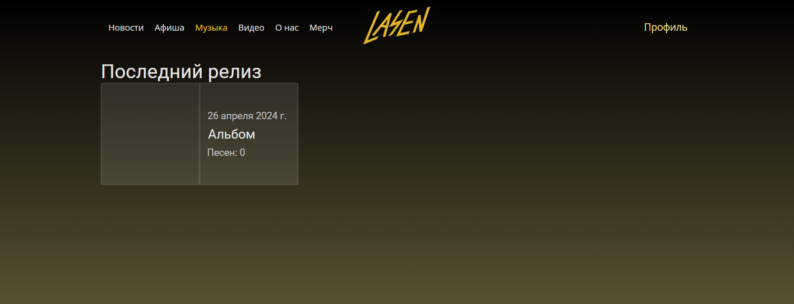

Сайт для музыкальной группы LASEN

Какие страницы есть на сайте?

- Главная, она же - новости. На ней находятся новости с заголовком, основным текстом и картинкой, 
так же к основному тексту можно добавлять ссылки на другие страницы сайта (видео, музыка и т.д.). 
В будущем планируется возможность писать комментарии к новостям (для этого пригодится авторизация, 
которую уже начали реализовывать).

- Афиша. На ней будет располагаться информация о предстоящих концертах группы. 
Информация в текстовом виде, а также ссылка на место проведения на картах. 
В будущем планируется добавить архив выступлений, где будут располгаться информация об уже прошедших концертах 
с сылками на соответствующие страницы сайта (видео с концерта или записанный live-альбом).

- Музыка. На ней будут располгаться альбомы группы, топ песен, а также мини-плеер, 
чтобы содержимое этой страницы можно было воспроизвести прямо на сайте.

- Видео. На ней располгаются мини-посты с заголовком и приложенным видео-роликом 
(видео прикладывается при помощи ссылки).

- О нас. Содержит в текстовом виде информацию о группе и её состав с сылками на каждого участника. 

- Мерч. Представляет собой мини-магазин. Все товары располгаются на одной странице, 
можно перейти на страницу каждого отдельного товара и оттуда добавить в корзину. 
Кнопка для перехода в корзину располгается пока только на вкладке мерч, 
в будущем также будет добавлена на страницу каждого товра. 
В корзине расположен список товаров и итоговая сумма, оформить заказ пока что нельзя, 
так как сама группа пока не располагает возможностью торговли.

- На сайте имеется "шапка", на которой расположены кнопки для перехода на страницы сайта, логотип группы 
(при клике на него переходит на страницу новости), кнопка для перехода в личный кабинет 
(предварительно будет вход или авторизация), однако пока эта функция имеет лишь заготовку, 
поэтому при клике пользователь останется на текущей странице.

- Ещё есть "подвал", на котором расположены ссылки на соцсети группы, почта и номер телефона для связи.

- Так же добавлена иконка сайта (один из логотипов группы)

